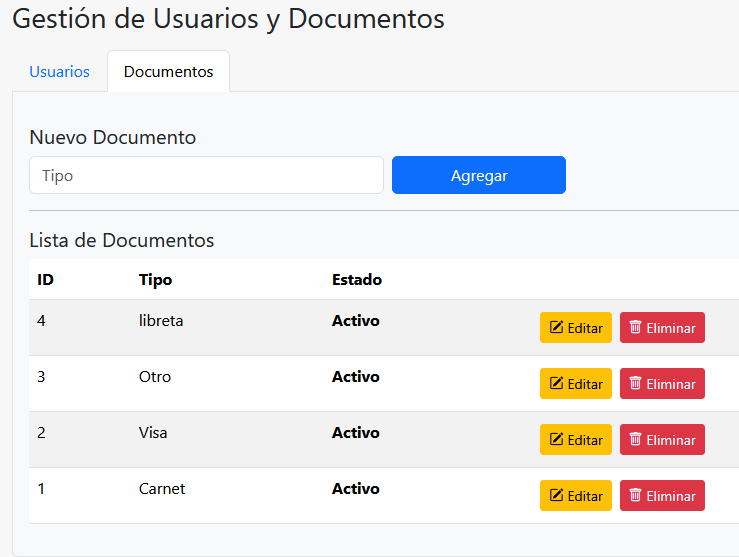
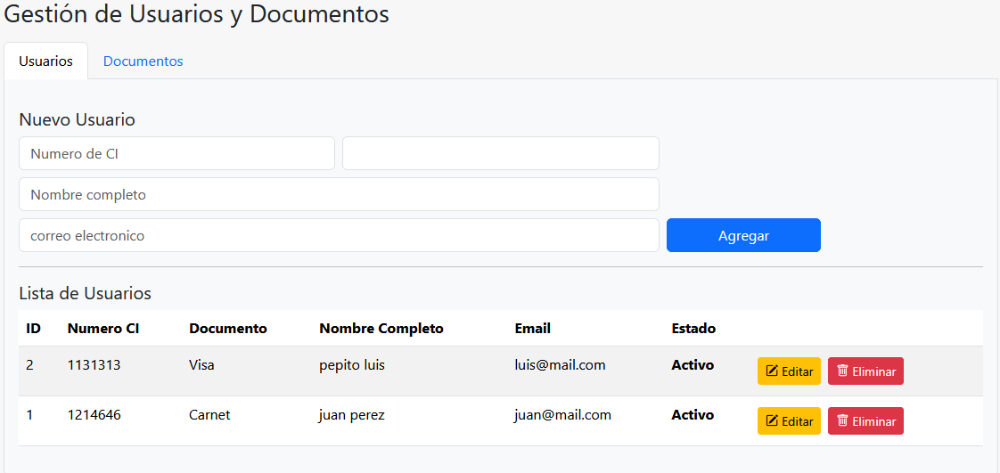
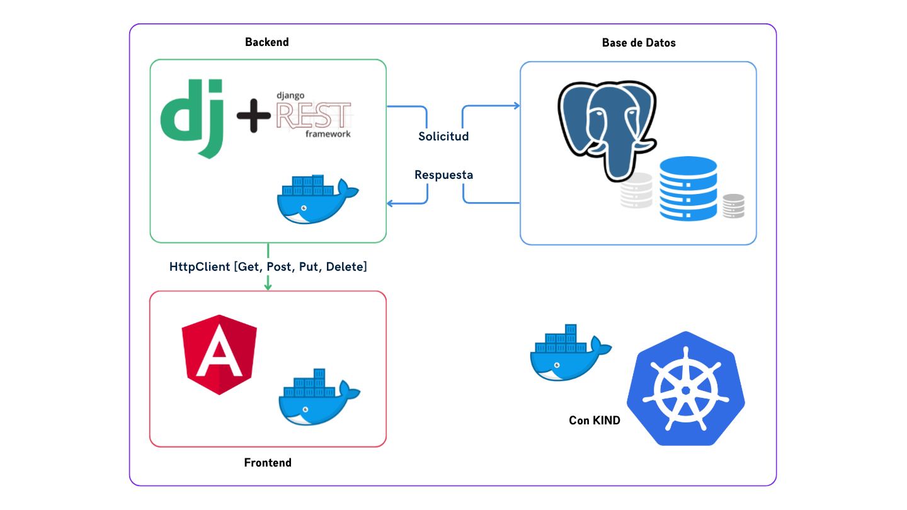
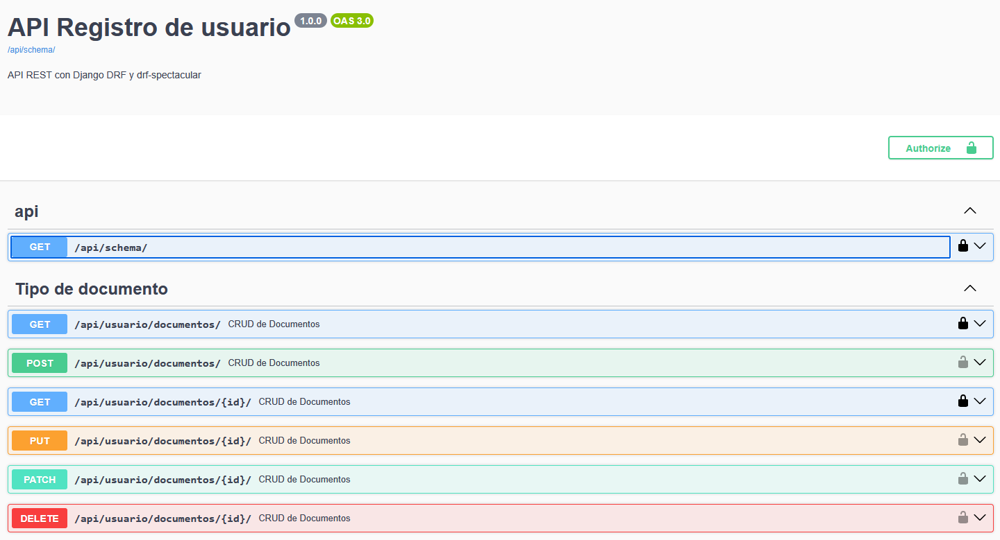
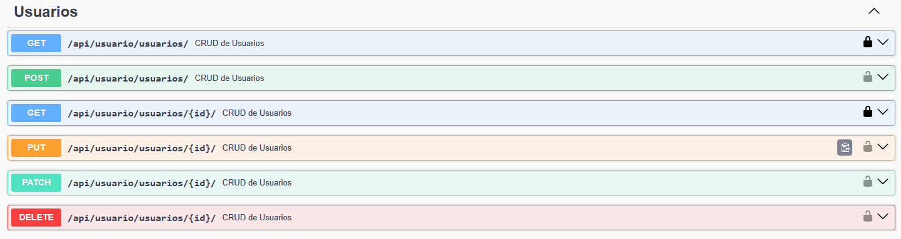
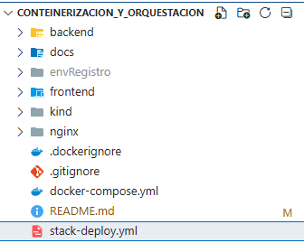

# Proyecto de Conteinerización y Orquestación (Django REST + Angular)

[Documento con capturas de pantalla](/docs/ContainerizationAndContainerOrchestration.pdf)

## Repositorio del proyecto

* https://github.com/ajahuanca/conteinerizacion_y_orquestacion
* https://github.com/ajahuanca/conteinerizacion_y_orquestacion.git 

Este repositorio contiene toda la configuración, código fuente y documentación técnica necesaria para construir, ejecutar y desplegar la aplicación completa, desde el entorno local hasta un clúster Kubernetes.

## 1) Descripción general
Este proyecto implementa una aplicación web completa para el registro y gestión de usuarios, desarrollada como parte de un ejercicio práctico de conteinerización y orquestación.

La aplicación está diseñada para demostrar la integración entre Django REST Framework (DRF) y Angular v18, complementada con una base de datos PostgreSQL y un entorno completamente dockerizado preparado para despliegue tanto local como en clústeres Docker Swarm y Kubernetes (KIND).

## Propósito del proyecto
El objetivo principal es aplicar los conocimientos adquiridos sobre contenedores, redes, volúmenes, servicios, orquestación y despliegue en clústeres, mediante la construcción de una aplicación modular, escalable y portable.

Para este fin práctico, el sistema implementa los modelos de:

* **Usuario**, con funcionalidades básicas de registro, listado, actualización y eliminación.
* **TipoDocumento (o Documento)**, que permite asociar tipos o categorías de documento a cada usuario.





Estos modelos exponen más de 6 endpoints REST funcionales, abarcando operaciones CRUD completas (Create, Read, Update, Delete) y demostrando el flujo completo de interacción entre frontend y backend.

## Arquitectura monolítica



La solución está compuesta por los siguientes módulos principales:

| Módulo                                                   | Descripción                                                                                                                                                                   |
| -------------------------------------------------------- | ----------------------------------------------------------------------------------------------------------------------------------------------------------------------------- |
| **Backend (Django REST Framework + drf-spectacular)**    | API REST desarrollada en Python/Django. Incluye endpoints para gestión de usuarios, documentos y autenticación básica. Documentación automática generada con Swagger y Redoc. |
| **Frontend (Angular v18 + Bootstrap + Bootstrap Icons)** | Interfaz moderna y responsiva. Contiene vistas en pestañas (tabs) para Usuarios y Documentos, formularios con validaciones y consumo de la API mediante `HttpClient`.         |
| **Base de Datos (PostgreSQL)**                           | Motor de base de datos relacional que almacena la información de usuarios y documentos.                                                                                       |
| **Adminer para gestión BD**            | Herramienta ligera de administración de base de datos incluida solo para entornos de prueba y desarrollo.                                                                     |
| **Infraestructura (Docker Compose, Swarm y Kubernetes)** | Permite la ejecución y orquestación de todos los servicios en contenedores, con configuración de redes, volúmenes, variables de entorno y balanceadores de carga.             |

## Componentes Clave y Funcionalidad
El proyecto ofrece:

* API REST estructurada en endpoints de Usuario y Documento (más de 6 endpoints disponibles).
* Documentación interactiva de API con drf-spectacular (`/api/docs/`).
* Frontend Angular con pestañas (Tabs) para la gestión independiente de cada módulo.
* Estilos y componentes visuales basados en Bootstrap 5 y Bootstrap Icons.
* Despliegue completo mediante Docker Compose (local), Docker Swarm (replicado) y Kubernetes KIND (clúster).




## Estructura base del proyecto



## Requisitos previos
- Docker (>=20)
- docker-compose (v2)
- docker swarm (para Swarm)
- kind (para cluster Kubernetes local)
- kubectl
- MetalLB y ingress-nginx para KIND

## 2) Desarrollo local (Docker Compose)

   Para el cumplimiento de esta sección, cada servicio cuenta con su archivo de configuracion de tipo Dockerfile tanto el backend como el frontend, con etiquetas versionadas, imagenes ligeras (Alpine), sin exposición de credenciales y .dockerignore configurado.

## 3) Desarrollo local (Docker Compose)
1. Copiar `.env` con variables sensibles:
   ```env
   POSTGRES_DB=appdb
   POSTGRES_USER=appuser
   POSTGRES_PASSWORD=apppassword
   POSTGRES_HOST=db
   POSTGRES_PORT=5432
   DJANGO_SECRET_KEY=dev-secret
   DEBUG=1
   ```

2. Levantar docker compose
   ```
   docker-compose up --build
   ```
3. Acceder a las rutas para verificar las aplicaciones
   * Frontend: http://localhost:8082
   * Backend: http://localhost:8000
   * Adminer: http://localhost:8081

## 4) Docker Swarm

1. Inicializamos Swarm
   ```
   docker swarm init
   ```
2. Creamos los secretos y el config para NGINX
   ```
   echo "apppassword" | docker secret create secret_password_db -
   echo "django_secret_key" | docker secret create secret_django -
   ```
3. Construimos las imagenes tanto del backend y frontend
   ```bash
   docker build -t registro-backend:1.0.0 -f backend/Dockerfile .
   docker build -t registro-frontend:1.0.0 -f frontend/Dockerfile .
   ```
4. Ahora desplegamos el Stack
   ```
   docker stack deploy -c stack-deploy.yml registro_stack
   ```
6. Visualizamos los servicios y sus tareas
   ```
   docker stack ps registro_stack
   docker service ls
   ```
7. Escalando el registro_stack_backend a 4
   ```
   docker service scale registro_stack_backend=4
   ```
8. Lista de las replicas del servicio stack backend
   ```
   docker service ps registro_stack_backend
   ```

En resumen se realizo:
- Conversión de docker-compose.yml a stack-deploy.yml
- Se tomó el archivo docker-compose.yml como base y se adaptó a las reglas de Docker Swarm, generando un nuevo archivo llamado stack-deploy.yml.
- En esta conversión se añadieron:
  - Sección deploy: en cada servicio, con configuración de réplicas y políticas de actualización.
  - Uso de configs y secrets externos, gestionados por Swarm.
  - Versionamiento de imágenes (registro-backend:1.0.0, registro-frontend:1.0.0).
  - Redes y volúmenes personalizados, mantenidos desde Compose.
Esto permitió que el mismo proyecto se ejecute como un stack distribuido y escalable, en lugar de simples contenedores aislados.

## 5) Kubernetes (KIND, conforme la lista designada)

Para el cumplimiento de esta sección se ha creado los siguientes archivos *.yaml
| Archivo               | Función                                                                                         |
| --------------------- | ----------------------------------------------------------------------------------------------- |
| **replicaset.yaml**   | ReplicaSet base para gestionar réplicas del backend.                                            |
| **deployment.yaml**   | Controlador de despliegue (Deployment) para versiones y actualizaciones del backend y frontend. |
| **service.yaml**      | Servicios internos para exponer backend y frontend dentro del cluster.                          |
| **loadbalancer.yaml** | LoadBalancer (o Ingress) para exponer el frontend y backend al exterior del cluster kind.       |
| **secret.yaml**       | Secret para almacenar variables sensibles (clave Django, contraseña DB).                        |

docker run -d --restart=always -p "5000:5000" --name registry registry:2

1. Creamos el cluster con KIND:
   ```
   kind create cluster --name app-cluster-registro
   ```
2. Se recomienda instalar MetalLB para LoadBalancer en KIND:

   * Siguir la guía oficial MetalLB; 
   * luego crear IP pool.

3. Ahora aplicamos los manifests:
   ```
   kubectl apply -f kind/deployment-backend.yaml
   kubectl apply -f kind/deployment-frontend.yaml
   kubectl apply -f kind/loadbalancer.yaml
   kubectl apply -f kind/service-backend.yaml
   kubectl apply -f kind/service-frontend.yaml
   ```
4. Revisamos si estan corriendo sus PODS
   ```
   kubectl get pods
   kubectl get svc
   ```

La Documentación se encuentra en PDF
[Documento con capturas de pantalla](/docs/ContainerizationAndContainerOrchestration.pdf)

## Buenas prácticas implementadas

* Dockerfiles optimizados en varias etapas.
* Imágenes base ligeras (alpine) por temas de practicidad.
* Variables de entorno y secretos (Docker secrets y Kubernetes Secrets).
* Volúmenes persistentes para Postgres.
* Red personalizada en Docker Compose y Swarm (overlay).
* Versionamiento de imágenes: registro/backend:1.0.0, registro/frontend:1.0.0.